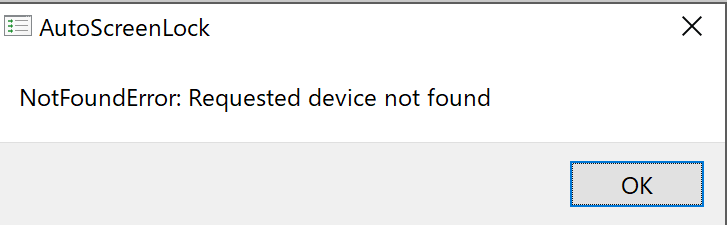

# AutoScreenLock

This is an electron app to lock screen automatically using web cam.

# Demo


# Usage

## Install App
```
git clone 
cd autoscreenlock
npm i electron -g
npm i
```

## Launch App

```
# for windows
start /b electron .
```

```
# for mac/linux (maybe...)
electron . &
```

The app starts to count down to lock your computer when you leave from the front of your computer after launching the app, 

## Troubleshoot
If you get `NotReadableError: Could not start video source` or `NotFoundError: Requested device not foound`, please reconnect your web cam to your computer or make it disabled/enabled from device manager.



----

Thanks to けしかん for Font "[DSEG](https://github.com/keshikan/DSEG)"
